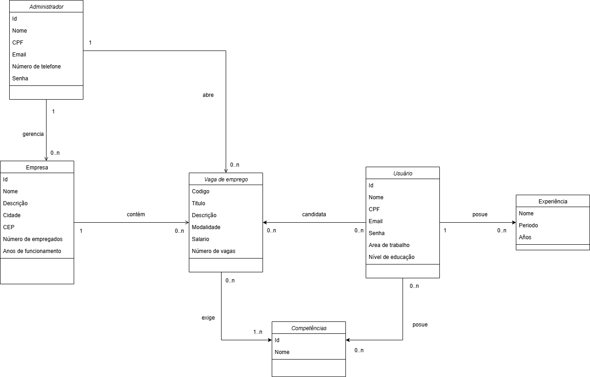

# Diagrama UML

Diagrama de classes onde são mostradas as quatro classes principais sendo estas administrador, usuário, companhia e oportunidade de emprego ademas de classes auxiliares utilizadas para dar atributos multivalorizados a algumas classes. Também aqui são mostradas as relações entre cada classe junto com suas paridades.

